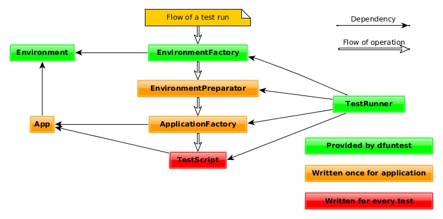

Overview
========

A simple framework for creating distributed functional tests. This library aims
to be for distributed functional tests what unittest libraries are for unit
tests.  It provides equivalent of test scenarios, runners, initializers and
dealocators in such a way that it is easy to configure new testing environment,
generate a report etc.

It is better than using bash/python scripts for such tasks, because:

* Changing testing environment or parameters is as easy as changing a few lines
  of configuration.
* dfuntest uses statically typed language - making sure your tests only fail
  when the actual code tested fails and not, because test scripts are buggy.
* Using Java makes it easy to write nontrivial testing scenarios.
* Allows you not to worry about how to correctly set up environment when
  writing each test.

Usage
=====

dfuntest is available in central Maven repository under following credentials:

    groupId: me.gregorias
    artifactId: dfuntest
    version: 0.4

dfuntest architecture is based on easily implementable interfaces, some of which
are provided by dfuntest and others need to be implemented to fit into
project's idiosyncrasies.

To use dfuntest you need to first prepare your project:

* Define your own EnvironmentPreparator, ApplicationFactory which prepare
  environment on which your application is run.
* Write App implementation which acts as a proxy to your application's
  interface.
* For each test scenario write a TestScript.
* Run tests using available TestRunners or define your own.

Running Example package
-----------------------

There is a simple example project in <code>me.gregorias.dfuntest.example</code>.
It shows a simple distributed application which is testable by dfuntest. To, for
example, run all prepared test scripts on 5 instances on local machine perform
the following:

    ./gradlew build buildExample copyAllDependencies
    cp ./build/libs/dfuntest*example.jar ./dfuntest-example.jar
    cp ./build/libs/dfuntest*.jar ./lib/
    java -cp dfuntest-example:lib/* me.gregorias.dfuntest.example.ExampleMain\
      9000 local 5

This should end successfully and download logs to <code>report/</code>
directory.

Advanced usage is explained in javadocs.

Building
========

dfuntest uses gradle with java plugin for typical java build operations.

    ./gradlew build

builds entire project, tests it and packages it.

    ./gradlew uploadArchives

publishes artifacts to maven repository. Note that this requires a valid PGP key
and credentials to `oss.sonatype.org`. Before uploading set proper version
number in `build.gradle`.

History
=======

This package was created as an effort to simplify the work of a test writer in
Nebulostore project while ensuring that those test will properly catch errors
and generate useful reports. 
